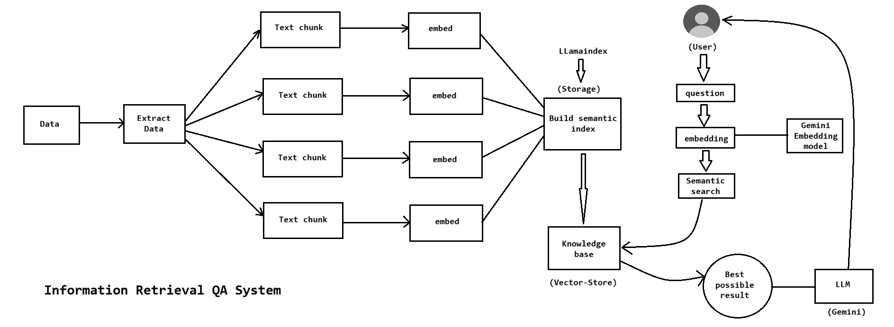

# 📄 QApplication — Document Q&A System with LlamaIndex & Gemini

A **Retrieval-Augmented Generation (RAG)** based Question Answering system that lets you upload any PDF document and ask natural language questions — powered by **Google Gemini** via **LlamaIndex**, with a clean **Streamlit** frontend.

---

## 🚀 Features

- 📂 Upload any PDF document through a simple web UI
- 💬 Ask natural language questions based on document content
- 🤖 Powered by Google Gemini LLM for intelligent, context-aware answers
- 🔍 Uses LlamaIndex for efficient document indexing and retrieval
- 🧩 Modular, production-ready codebase broken into focused components
- 🖥️ Interactive Streamlit web interface

---

## 🏗️ Project Structure

```
QApplication/
│
├── QAWithPDF/                  # Core application package
│   ├── __init__.py
│   ├── data_ingestion.py       # Handles PDF loading and parsing
│   ├── embedding.py            # Manages document embedding using Gemini
│   └── model_api.py            # Interfaces with Gemini LLM via LlamaIndex
│
├── data/                       # Directory for uploaded documents
├── Experiments/                # Experimental/prototype notebooks and scripts
├── logs/                       # Application logs
├── storage/                    # Persisted index/vector storage
│
├── StreamlitApp.py             # Main Streamlit web application entry point
├── template.py                 # Script to auto-generate project folder/file structure
├── setup.py                    # Package setup for installable module
├── exception.py                # Custom exception handling
├── logger.py                   # Logging configuration
├── .env                        # Environment variables (API keys — not committed)
├── requirements.txt            # Python dependencies
└── README.md
```

---

## 🏛️ Architecture

### System Overview



### Component Breakdown

#### 1. **Frontend Layer** (`StreamlitApp.py`)
- Provides web interface for PDF upload
- Displays chat-like interface for Q&A
- Handles user interactions and session state

#### 2. **Data Ingestion** (`data_ingestion.py`)
- Loads PDF documents using PyPDF
- Splits documents into manageable chunks
- Prepares text for embedding generation

#### 3. **Embedding Layer** (`embedding.py`)
- Converts document chunks into vector embeddings
- Uses Gemini Embedding model (`models/embedding-001`)
- Persists vectors in local storage for quick retrieval
- Creates and manages the vector index

#### 4. **Query Engine** (`model_api.py`)
- Receives user questions
- Performs semantic search against stored embeddings
- Retrieves top-k relevant document chunks
- Sends context + question to Gemini LLM
- Returns grounded, context-aware answers

#### 5. **Storage Layer** (`./storage/`)
- Persists vector indices locally
- Enables fast retrieval without re-embedding
- Reduces API calls and improves response time

### RAG Pipeline Flow

---
## 🛠️ Tech Stack

| Layer | Technology |
|---|---|
| LLM | Google Gemini (`llama-index-llms-gemini`) |
| Embeddings | Gemini Embeddings (`llama-index-embeddings-gemini`) |
| RAG Framework | LlamaIndex |
| PDF Parsing | PyPDF |
| Frontend | Streamlit |
| Config Management | python-dotenv |

---

## ⚙️ Setup & Installation

### 1. Clone the Repository

```bash
git clone https://github.com/your-username/QApplication.git
cd QApplication
```

### 2. Create and Activate a Virtual Environment

```bash
python -m venv .venv
source .venv/bin/activate        # On Windows: .venv\Scripts\activate
```

### 3. Install Dependencies

```bash
pip install -r requirements.txt
```

Or install the package in editable mode:

```bash
pip install -e .
```

### 4. Configure Environment Variables

Create a `.env` file in the root directory:

```env
GOOGLE_API_KEY=your_google_gemini_api_key_here
```

> 🔑 Get your Gemini API key from [Google AI Studio](https://aistudio.google.com/app/apikey)

---

## ▶️ Running the Application

```bash
streamlit run StreamlitApp.py
```

Then open your browser at `http://localhost:8501`, upload a PDF, and start asking questions!

---

## 📦 Dependencies

```
llama-index
google-generativeai
llama-index-llms-gemini
llama-index-embeddings-gemini
pypdf
python-dotenv
streamlit
ipykernel
IPython
```

---

## 🧪 Experiments

The `Experiments/` folder contains early-stage prototype scripts used to validate the core functionality (document ingestion → embedding → querying) before the modular refactor into the `QAWithPDF` package.

---

## 📝 How It Works

1. **Data Ingestion** — The uploaded PDF is loaded and parsed using `PyPDF` via LlamaIndex's document loaders (`data_ingestion.py`)
2. **Embedding** — Document chunks are embedded using Gemini Embeddings and stored locally in the `storage/` directory (`embedding.py`)
3. **Query** — User questions are embedded and matched against stored vectors; the top relevant chunks are passed to Gemini LLM for a grounded answer (`model_api.py`)
4. **Interface** — The Streamlit app ties everything together in a clean, interactive UI (`StreamlitApp.py`)

---

## 👤 Author

**Pratik Salunkhe**
📧 pratikvsalunkhe924@gmail.com

---

## 📄 License

This project is for educational and personal use. Feel free to fork and extend it!